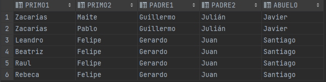
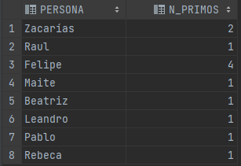
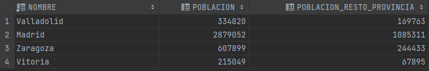
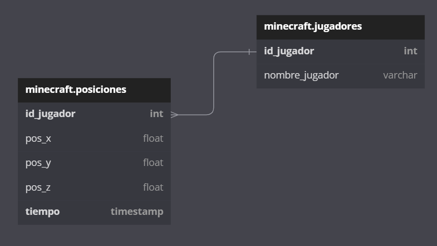

# GBD - Portfolio Marzo - Alejandro Giner

# Resumen

En las unidades 6 y 7 se ha visto DQL (*data query language*, lenguaje de consulta de datos), que no es más que la instrucción `SELECT` en todas sus formas y posibilidades.

## Bases y consultas de una tabla
De las competencias básicas de `SELECT` cabe destacar, entre otras:
- Formato de columnas
  - Conversión y formato de fechas, números y texto (`TO_CHAR`, `TO_DATE`, `TO_NUMBER`)
  - Manipulación numérica (`ROUND`, `TRUNC`, `CEIL`, `FLOOR`...)
  - Manipulación de texto (`REPLACE`, `TRANSLATE`, `REVERSE`...)
  - Expresiones condicionales (`DECODE`, `CASE`)
- Filtrado de resultados (cláusula `WHERE`)
  - Comparaciones numéricas simples (mayor/menor/igual/distinto que...)
  - Búsqueda de patrones con `LIKE` y expresiones regulares (familia de funciones `REGEXP_*`)

En la unidad 7 se ha expandido lo visto en la 6 añadiendo consultas que funcionan a través de varias tablas, usando la cláusula `JOIN`.

## Consultas de varias tablas

Se ha visto el recorrido histórico de este tipo de consultas, desde usar la cláusula `FROM` con varias tablas junto con `WHERE` para filtrar los resultados deseados en SQL-92 hasta todos los tipos de `JOIN` de SQL:1999:
- `[INNER] JOIN`
  - `ON`: permite relacionar por columnas de distinto nombre.
  - `USING`: sólo relaciona por columnas con el mismo nombre en ambas tablas.
- `[LEFT|RIGHT] OUTER JOIN`
  - También puede usar `ON` o `USING`
  - Junta además las filas que no coincidan, de una tabla u otra (o ambas) dependiendo de la dirección.
- `CROSS JOIN`
  - Junta todas las filas de una tabla con todas las filas de la otra.
- `NATURAL JOIN`
  - Busca automáticamente columnas con mismo nombre en ambas tablas. Es un `JOIN USING` automático.


## Consultas de totales
Todo lo anterior nos permite hacer una gran cantidad de consultas, pero hay una gran carencia: no se puede trabajar fácilmente con datos a través de varias filas (o mejor dicho, en filas arbitrarias, ya que sí se podría, por ejemplo, comparar todas las filas con una fila concreta usando `JOIN`).

Para esto están las consultas de totales, que se basan en funciones que operan en varias filas.
Para ayudarlas, se introducen nuevas cláusulas:
- `GROUP BY`: agrupa las filas para determinar qué rango van a tener las funciones.
- `HAVING`: aplica condiciones después de agrupar y calcular las funciones de totales. Esta cláusula es necesaria puesto que `WHERE` tiene un propósito distinto, imponer condiciones a filas individuales antes de agruparlas.

Las funciones de totales más importantes son:
- `COUNT`: cuenta la cantidad de datos que existen. Se puede aplicar a la fila entera con un asterisco, o especificar una columna en caso de que se quieran contar las que no son nulas.
- `SUM`: suma todos los valores en una columna. Sólo funciona con números.
- `AVG`, `MAX`, `MIN`: calcula la media, máximo o mínimo sobre una serie de números. El resultado en este caso es un escalar.

# Reflexiones personales

Para mí ha sido la parte más interesante de la asignatura hasta la fecha (aunque no me cabe duda de que cada tema es más interesante que el anterior y esto se seguirá cumpliendo en el futuro). A mi parecer, un conocimiento extendido de DQL aumenta de forma **exponencial** las posibilidades que tienen las bases de datos en aplicaciones prácticas. Tanto es así que siempre intento aplicar de alguna forma u otra los conocimientos en cualquier proyecto personal que se me pueda ocurrir, aunque muchas veces no llegue muy lejos en él.

No tengo nada negativo que decir, pero respecto al lado positivo, lo mejor a mi parecer son las consultas en varias tablas; siento que es lo que más posibilidades abre respecto a la obtención de datos relacionados de manera significativa.

# Ejercicios significativos

- Práctica 17, ejercicio 14:
  Mostrar tipo y modelo de todas las piezas, junto con el número del almacén en el que se guardan o "Sin almacén" si no se guardan en ninguno.
```sql
SELECT TIPO, MODELO,
        NVL(TO_CHAR(N_ALMACEN),'Sin almacén') AS N_ALMACEN
FROM PIEZAS
LEFT OUTER JOIN EXISTENCIAS USING (TIPO, MODELO)
ORDER BY TIPO, MODELO, N_ALMACEN;
```
Hay que usar un `LEFT OUTER JOIN` para obtener las piezas que no estén en ningún almacén.

- Práctica 20, ejercicio 3:
  Mostrar información de aquellos goles que contengan el nombre de algún jugador en su descripción.
```sql
SELECT G.DESCRIPCION, G.MINUTO, J1.NOMBRE
FROM GOLES G
JOIN JUGADORES J1 USING(ID_JUGADOR)
CROSS JOIN JUGADORES J2
WHERE REGEXP_LIKE(G.DESCRIPCION, J2.NOMBRE);
```
Usamos un `CROSS JOIN` ya que no hay forma de cumplir la condición con un `JOIN` de ningún otro tipo; en su lugar, buscamos el nombre dentro de la descripción usando `REGEXP_LIKE` (también se podría con `LIKE`).

- Práctica 18, ejercicio 25:
  Mostrar información de las provincias que tengan más habitantes que la provincia de Guipúzcoa.
```sql
SELECT P.NOMBRE, P.POBLACION FROM (
    SELECT P.NOMBRE AS NOMBRE, SUM(L.POBLACION) AS POBLACION
    FROM PROVINCIAS P
    JOIN LOCALIDADES L USING (N_PROVINCIA)
    GROUP BY P.NOMBRE) P
CROSS JOIN (
    SELECT P.NOMBRE AS NOMBRE, SUM(L.POBLACION) AS POBLACION
    FROM PROVINCIAS P
    JOIN LOCALIDADES L USING (N_PROVINCIA)
    WHERE P.NOMBRE='Guipuzcoa'
    GROUP BY P.NOMBRE) GUIPUZCOA
WHERE P.POBLACION > GUIPUZCOA.POBLACION
ORDER BY P.POBLACION;
```
Esta consulta puede parecer muy complicada a simple vista, pero habiendo hecho la versión simple (comparando localidades), se puede trabajar a partir de la estructura previa añadiendo poco a poco lo que se necesita. En este caso, son subconsultas, que nos producirán tablas (vistas) que serán análogas a la tabla de localidades, pero representando provincias, usando la función `SUM` junto con `GROUP BY` para obtener la población total de cada provincia. Una vez uno se da cuenta de esto, no tiene mayor dificultad que comparar poblaciones de localidades.

- Práctica 19, ejercicio 5:
  Mostrar el nombre de las madres que hayan tenido 2 hijas.
```sql
SELECT MADRES.NOMBRE, COUNT(*)
FROM PERSONAS P
JOIN PERSONAS MADRES ON (P.N_MADRE=MADRES.N_PERSONA)
WHERE P.SEXO='M'
GROUP BY MADRES.NOMBRE
HAVING COUNT(*)=2;
```
Consiste en obtener a cada persona con su madre, contando sólo las mujeres, agrupar por madres y usar `COUNT` para ver cuántas hijas tiene cada madre.

- Práctica 21, ejercicio 6:
  Mostrar equipos que han perdido más de 25 partidos en casa en la temporada 2021-22.
```sql
SELECT CIUDAD, NOMBRE,
       COUNT(*) PARTIDOS_PERDIDOS
FROM EQUIPOS E
JOIN PARTIDOS P on E.ID_EQUIPO = P.ID_EQUIPO_LOCAL
WHERE INICIO_TEMP=2021 AND FIN_TEMP=2022 AND PUNTOS_LOCAL<PUNTOS_VISITA
GROUP BY CIUDAD, NOMBRE
HAVING COUNT(*)>25
ORDER BY PARTIDOS_PERDIDOS DESC, CIUDAD DESC, NOMBRE;
```
Se juntan los partidos con sus equipos locales, seleccionando sólo aquellos partidos de la temporada 2021-22, y en los que el equipo local haya perdido. A continuación se agrupa por equipos locales (el nombre y la ciudad determina el equipo) y se cuentan los partidos resultantes.

# Ejercicios de invención propia

## 1. Esquema **padremadre**: Listar parejas de primos:
```sql
SELECT PRIMO1.NOMBRE AS PRIMO1,PRIMO2.NOMBRE AS PRIMO2,
       PADRE1.NOMBRE AS PADRE1, PADRE2.NOMBRE AS PADRE2, ABUELO.NOMBRE AS ABUELO
FROM PERSONAS PRIMO1
JOIN PERSONAS PADRE1 ON (PRIMO1.N_PADRE=PADRE1.N_PERSONA)
JOIN PERSONAS PADRE2 ON (PADRE1.N_PADRE=PADRE2.N_PADRE)
JOIN PERSONAS PRIMO2 ON (PRIMO2.N_PADRE=PADRE2.N_PERSONA)
JOIN PERSONAS ABUELO ON (PADRE1.N_PADRE=ABUELO.N_PERSONA)
WHERE PADRE1.N_PERSONA!=PADRE2.N_PERSONA AND PRIMO1.N_PERSONA>PRIMO2.N_PERSONA;
```

Así la consulta muestra parejas de primos y primas, así como sus padres y su abuelo común, pero sólo aquellos relacionados patrilinealmente.


También he hecho una variación de esta consulta, que muestra el número de primos que tiene cada persona (hay que prestar atención a las comparaciones de `N_PERSONA` en el `WHERE`):
```sql
SELECT PRIMO1.NOMBRE AS PERSONA, COUNT(*) AS N_PRIMOS
FROM PERSONAS PRIMO1
JOIN PERSONAS PADRE1 ON (PRIMO1.N_PADRE=PADRE1.N_PERSONA)
JOIN PERSONAS PADRE2 ON (PADRE1.N_PADRE=PADRE2.N_PADRE)
JOIN PERSONAS PRIMO2 ON (PRIMO2.N_PADRE=PADRE2.N_PERSONA)
WHERE PADRE1.N_PERSONA!=PADRE2.N_PERSONA AND PRIMO1.N_PERSONA!=PRIMO2.N_PERSONA
GROUP BY PRIMO1.N_PERSONA, PRIMO1.NOMBRE;
```


## 2. Esquema **geografia**: Mostrar localidades cuya población es mayor que el resto de las localidades de su provincia combinadas:
```sql
SELECT L1.NOMBRE, L1.POBLACION, SUM(L2.POBLACION) AS POBLACION_RESTO_PROVINCIA
FROM LOCALIDADES L1
JOIN LOCALIDADES L2 USING (N_PROVINCIA)
WHERE L1.ID_LOCALIDAD!=L2.ID_LOCALIDAD
GROUP BY L1.NOMBRE, L1.POBLACION, L1.ID_LOCALIDAD
HAVING SUM(L2.POBLACION)<L1.POBLACION;
```
Muestra el nombre y la población de cada localidad que tenga más población que el resto de su provincia, así como dicha población.


## 3. EXTRA: Mi propia base de datos
Debajo se puede ver el diagrama de una base de datos que he diseñado. Es bastante simple, teniendo dos tablas, ya que fue diseñada con un propósito muy específico: guardar información de los jugadores de un servidor de Minecraft en el que juego con mis amigos.

Minecraft es un juego en 3D, por lo que la tabla de posiciones tiene 3 atributos, uno por cada componente del vector posición.

La forma de poblar esta tabla ha sido mediante un script en Python que se ejecuta cada cierto tiempo (en mis pruebas fue cada 10 segundos), que usaría el protcolo [RCON](https://wiki.vg/RCON), que permite ejecutar comandos en el servidor de forma remota, para pedir la información necesaria con el comando `/data get entity {player} Pos`.


La idea de esta base de datos es llevar un seguimiento de por dónde se mueven los jugadores, para luego presentar esta información de alguna forma gráfica, como un mapa de calor, o mostrando el camino tomado por cada jugador.

Se me ocurren varias consultas que se podrían hacer, como por ejemplo:
- Mostrar la distancia media al origen de coordenadas de cada jugador
```sql
SELECT nombre_jugador, AVG(DISTANCE)
FROM (
  SELECT id_jugador, SQRT(POWER(pos_x,2)+POWER(pos_y,2)+POWER(pos_z,2)) AS DISTANCE
  FROM posiciones
)
-- se podría añadir WHERE para filtrar posiciones dependiendo del timestamp, o sólo ciertos jugadores
JOIN jugadores USING (id_jugador)
GROUP BY id_jugador
-- se podría usar HAVING para obtener sólo las distancias medias mayores que cierto valor
```

NOTA: la base de datos originalmente fue diseñada en SQLite. Esto es una representación de cómo se usaría si estuviera en Oracle SQL.
# Conclusiones

Me está resultando muy interesante descubrir todas las posibilidades que ofrecen las bases de datos en cuanto a la manipulación de los datos para mostrarlos como uno quiera.

La mayor dificultad de estas unidades ha sido los `JOIN` más difíciles que han salido en los ejercicios de alto nivel; me es complicado ver exactamente cuál sería la mejor forma de hacerlo, con lo que suelo recurrir a `CROSS JOIN` o cosas por el estilo.